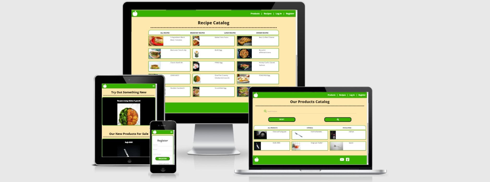
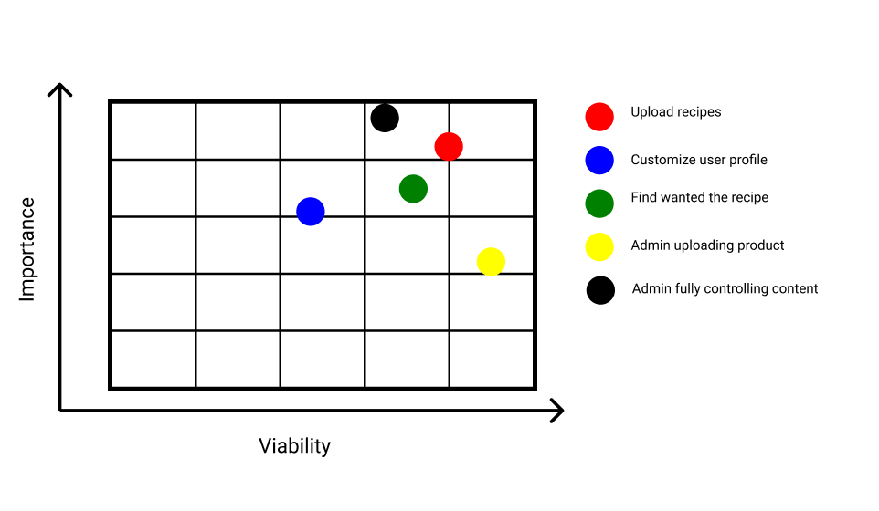
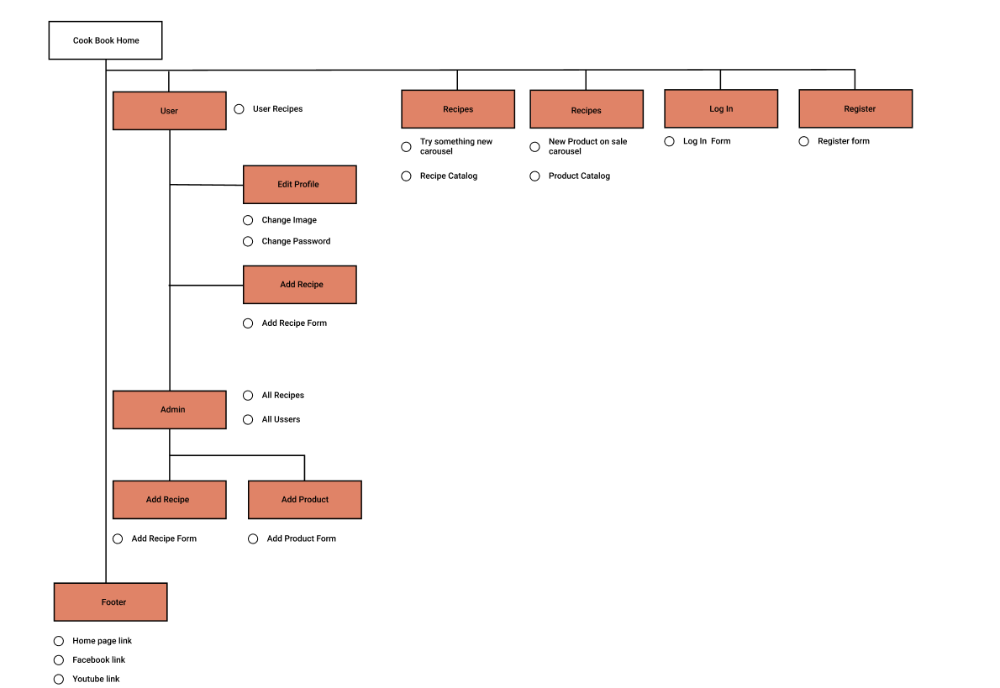

<h1 align="center">
  COOK BOOK
</h1>
  
<h2 align="center">
  Share your favorite recipes
</h2>
  

  Find and share recipes with people all over the world.

[View the live project here](http://coock-book-ci-msp3.herokuapp.com/home)

## Table of contents
1. [UX](#UX)
    1. [Project Goals](#Project-Goals)
    2. [User Stories](#User-Stories)
    3. [Development Planes](#Development-Planes)
2. [Features](#Features)
3. [Issues and Bugs](#Issues-and-Bugs)
4. [Admin User Information](#Admin-User-Information)
4. [Technologies Used](#Technologies-Used)
     1. [Main Languages Used](#Main-Languages-Used)
     2. [Frameworks, Libraries & Programs Used](#Frameworks-Libraries-&-Programs-Used)
5. [Testing](#Testing) ☞ **[Testing.md](TESTING.md)**
6. [Deployment](#Deployment)
7. [Credits](#Credits)
     1. [Audio](#Audio)
     2. [Code](#Code)
***

***

## UX 
### Project Goals
The primary goal of "Cook Book" is to provide a web page for people to write their own recipes or to find someone else recipes.

This is the third of four Milestone Projects that the developer must complete during their Full Stack Web Development Program at The Code Institute. 

The main requirements were to design, develop and implement a web application using **HTML5**, **CSS3**, **JavaScript**, **Python+Flask**, **MongoDB**.

#### User Goals
The user is looking for:
- A place to find new recipes.
- A place to write down their own recipes.
- An intuitive interface.
- To find some products to use on their recipes.

#### Developer Goals
The Developer is looking to:
- Create a web page for user to share recipes.
- Create a web page for owner to upload products.
- Demonstrate their skills in software development, using newly learned languages and libraries.
- Deploy a project on their portfolio.

### User Stories
**As a user, I want to:**

1. Intuitive navigations.
2. Have a catalogue of available recipes.
3. Have a catalogue of their own recipes.
4. Have a catalogue of available products.
5. To customize my profile.

### Development Planes

To create and design a web recipe book, the developer distinguishes the necessary functionality of the web page and how it would answer to the user stories:

<strong>1. <u>Strategy</u></strong>

Broken into two categories, the website will focus on the following target audiences:
- **Roles:**
     - New users
     - Current users
     - Owner

- **Demographic:**
     - Cooking enthusiasts
     - Product supplier

The website needs to enable the **user** to:
- Easily register
- Easily log in to their profile
- Be able to see all recipes
- Be able to search for a recipe
- Be able to see available products
- Be able to customize their profile
- Easily upload their own recipe

With these goals in mind, a strategy table was created:

<strong>2. <u>Scope</u></strong>

A scope was defined to clearly identify what needed to be done to align features with the strategy:
- **Content Requirements**
     - The user will be looking for:
          - Easy to find recipes
          - Easy to find products
          - See their own recipes
          - See all users (for admin)
- **Functionality Requirements**
     - The user will be able to:
          - Be able to register to web page easily
          - Easily find wanted recipe
          - Easily navigate through the pages
          - Customize the profile
          - Control all content (for admin)

<strong>3. <u>Structure</u></strong>

The web page content is divided through multiple pages in a tree like pattern for easy navigating and distinguishing content. The **hierarchial tree structure**:

<strong>4. <u>Skeleton</u></strong>

Wireframe mockup was created on paper.

[Back to top ⇧](#table-of-contents)

## Features
All features are responsive and intuitive:
- **Navigation Bar** - Navigation bar is fixed to the top of the screen. The bar contains all links to the web pages on Cook Book. On smaller screens the navigation bar unfolds on the ride side of the screen after pressing the bar icon.
- **Home Page/Recipe Page Recipe Carousel** - Carousel displays three random recipes from the database. Clicking and dragging it the image to the side slides the image to the side and reveals next image. Clicking on the recipe opens a model with the ingredient list and directions list.
- **Home Page/Product Page Product Carousel** - Caraouel displays two random products from the database. Clicking and dragging it the image to the side slides the image to the side and reveals next image. Clicking on the product opens a model with the products descriptions.
- **Footer Navigations** - The footer contains the link to the home page and links to the Facebook and YouTube pages.
- **Search** - Recipe and product page have a sear feature. Entering a word or words and clicking the search icon displays, recipes/products in the recipes/product catalog under the all recipes/all products section. The sear engine looks for the relevant word in the name or the descriptions section (for products) on the database.
- **Catalogs** - Recipe and product pages contain a catalog for all recipes of catalogs. The catalog is separated by types of recipes or products. Clicking on the catalog link will display the selected type of recipes or catalogs:
     - For recipes. The links on the catalog are: all recipes, breakfast recipes, lunch recipes, dinner recipes.
     - For products. The links on the catalog are: all products, utensils, pots and pans.
- **Register** - On registering page new user can register an account.
     - The user must enter all form inputs top successfully register.
     - If password does not match a flash message appears after clicking register button.
     - After user register the user data is stored in the database.
     - If username already exists a flash message appear telling the user that the username already exists.
- **Log In** - Registered user can log in. If the user enters the wrong username or password a flash message appears telling the user they entered wrong username or/and password.
- **Registered user functions** - All user functions are accessible from the user profile page witch appears on the navigation bar after user logs in:
     - After clicking the edit button under the profile image user can change their profile image or password. The password can be changed only if the user enters password correctly two times.
     - User can see all their recipes under their profile information.
     - User can edit or delete any recipe they entered.
     - User can add any new recipe after clicking add recipe button.
- **Add Recipe/Product Form** - After clicking add recipe/add product a user is redirected to add recipe/add product form.
     - Recipe name input will store recipe name in the database.
     - Clicking remove button next to the ingredient input file will remove that ingredient. 
     - Clicking add ingredient button will add an empty input field.
     - Clicking the remove button next to direction input field will remove that direction. 
     - Clicking add directions button will add an empty direction input field.
     - Selecting one of the radio buttons will set the meal type.
     - Clicking the upload image will open "Cloudinery" widjet and will be able to upload image from there onwe device.
     - Clicking add recipe button will add a recipe to the database, clicking cancel button will return to the profile page.
- **Edit Recipe/Product Form** - An edit form opens after the user clicks on the edit recipe/edit product button on recipe/product modal display. The form features all functions like add form described above.
- **Admin Functions** - Admin user has all the functions like a regular user plus some extra functions. Extra functions:
     - The Admin user can see all the recipes on the profile page and delete any recipe. After selecting a recipe a modal display appears and on the bottom of the modal there is a delete button. Clicking delete button will display another modal to confirm delete action.
     - Admin users can see all users and delete any user. After clicking on a user a modal display appears. After clicking the delete button another modal appears to verify the delete action.
     - The Tdmin user can add/edit products. The add/edit product function works the same way it was described above.

[Back to top ⇧](#table-of-contents)

## Admin User Information

     Username - Admin
     Password - Admin (key sensitive)

## Issues and Bugs 
The developer ran into a number of issues during the development of the game, with the noteworthy ones listed below, along with solutions.

**Upload Image to Database** - At the early stages of the page development, developer ran into uploading image to the dababes. Uploading images to MongoDb is possible, but considered bad practice, this was determined after more research about media uploading to the database. A substituted database was found for media upload: [Cloudinary](https://cloudinary.com/). Cloudinary datastorig allows to save links to the image and store that link in MongoDB.

**Ingredients Storing Ass List** - Getting multiple ingredients or directions as a list or array to store in the database. A solution was found in Code Institute Back-end Development Mini Project videos. Getting all input fields with the same list and storing them as a list by adding getlist (request. form. getlist ("recipe_ingredient")). The data was stored as an array.

**Can not Edit Meal Type for a Recipe** - After loading a recipe on the edit recipe page radio button would not show what type of meal it was on the big screens. On small it would be stuck on one of the selections with no way to change them. Problem was, there were too many selections and active buttons ate both big and small screens. The solution was to optimize and reduce the complexity of the code.

**Can't Remove or Add Ingredients/Directions** - After loading a recipe on the edit recipe page could not add another input after clicking add an ingredient or add direction button. Could not remove ingredient or direction after clicking remove button next to the direction or ingredient. The problem was they use the same script with the same id names. The solution was to create separate scripts to add/edit recipes/products with different id names.

**Upload Image Widjet Script** - After using [Cloudinary's](https://cloudinary.com/) upload image widget for adding recipe page for adding an image for the recipe, it would not work for profile and product image upload. The problem was that the script could only get one id and could not recognize witch widget button to use. The solution was to create custom attributes and custom values and add custom code for Cloudinary script, to check if the value is true or not, so as to know which widget was being used.

[Back to top ⇧](#table-of-contents)

## Technologies Used
### Main Languages Used
- [HTML5](https://en.wikipedia.org/wiki/HTML5 "Link to HTML Wiki")
- [CSS3](https://en.wikipedia.org/wiki/Cascading_Style_Sheets "Link to CSS Wiki")
- [JavaScript](https://en.wikipedia.org/wiki/JavaScript "Link to JavaScript Wiki")
- [Python](https://en.wikipedia.org/wiki/Python_(programming_language) "Link to Python Wiki")

### Frameworks, Libraries & Programs Used
- [Materialize](https://materializecss.com/ "Link to Materialize page")
     - Materialize was used to implement the responsiveness of the site, using materialize classes.
- [jQuery](https://jquery.com/download/ "Link to jQuery page")
     - jQuery was used to simplify the JavaScript code used.
- [Google Fonts](https://fonts.google.com/ "Link to Google Fonts")
    - Google fonts was used to import the fonts "Open Sans" and "Lobster".
- [Font Awesome](https://fontawesome.com/ "Link to FontAwesome")
     - Font Awesome was used for graphical indication of features buttons.
- [Git](https://git-scm.com/ "Link to Git homepage")
     - Git was used for version control by utilizing the GitPod terminal to commit to Git and push to GitHub.
- [GitHub](https://github.com/ "Link to GitHub")
     - GitHub was used to store the project after pushing.
- [jQuery Validation](https://jqueryvalidation.org/ "Link to jQuery Validation page")
     - jQuery Validation was used to simplify form validation for the **Feedback Form**.
- [Am I Responsive?](http://ami.responsivedesign.is/# "Link to Am I Responsive Homepage")
     - Am I Responsive was used in order to validate the responsiveness of the design.

[Back to top ⇧](#table-of-contents)

## Testing

Testing information can be found in a separate testing [file] Prideti testing fila

## Deployment

This project was developed using [Visual GitHub](https://github.com/ "Link to GitHub site").

### Deploying on Heroku Pages
To deploy this page to Heroku Pages from GitHub repository, the following steps were taken:

**Enabling GitHub integration**

1. You can configure GitHub integration in the Deploy tab of apps in the [Heroku Dashboard](https://dashboard.heroku.com/apps "Link to Herocku Dashboaard").

2. To configure GitHub integration, you have to authenticate with GitHub. You only have to do this once per Heroku account.

3. After you link your Heroku app to a GitHub repo, you can selectively deploy from branches or configure auto-deploys.

**Automatic deploys**

1. When you enable automatic deploys for a GitHub branch, Heroku builds and deploys all pushes to that branch. If, for example, you have a development app on Heroku, you can configure pushes to your GitHub development branch to be automatically built and deployed to that app.

2. If you’ve configured your GitHub repo to use automated Continuous Integration (with Travis CI, for example), you can check the “Wait for CI to pass before deploy” checkbox. When enabled, Heroku will only auto-deploy after all the commit statuses of the relevant commit show success.
This commit won’t auto-deploy because one of the checks shows a pending status.

3. This commit will auto-deploy because all of the checks show a status of success.

**Review apps**

With review apps enabled for a Heroku app, Heroku will create temporary test apps for each pull request that’s opened on the GitHub repo that’s connected to the parent app. Review apps are great if you’re using GitHub Flow to propose, discuss, and merge changes to your code base. Because pull request branches are deployed to new apps on Heroku, it’s very simple for you and your collaborators to test and debug code branches. You can also run automated integration tests on the Heroku app representing a GitHub branch.

See the [Review apps article](https://devcenter.heroku.com/articles/github-integration-review-apps "Link for app article") for details.

**Heroku CI**

Once you’ve connected your GitHub repo to your Pipeline, you can turn on [Heroku CI](https://devcenter.heroku.com/articles/heroku-ci "Link to Heroku CI"), our visual, low-configuration test runner that integrates easily with Heroku Pipelines (and so complements Review apps, existing Heroku apps, and our GitHub integrations). Any Heroku Pipeline is already Heroku CI ready – just turn it on in the Pipeline’s Settings tab.

**Links to diffs**

For apps that are linked to GitHub repos, releases in the Dashboard Activity tab will include a “View Diff” link. Following the link will take you to the GitHub comparison view, showing the changes made since the last release.

**Disconnecting from GitHub**

Individual apps can be disconnected in the GitHub pane of the Deploy tab for the app.

[Back to top ⇧](#table-of-contents)

## Credits 

### Images and Recipes
All images were uploaded from [Unsplash](https://unsplash.com "Link to Unsplash page")

- **User**
     - Admin profile picture - Author: Ben Parker
- **Utensils**
     - Knife 5000 picture - Author: Marios Gkortsilas
     - Fork Forkametic picture - Author: Matt Popovich
     - Spoon picture - Author: Anna Kumpan
- **Pons & Pans**
     - Orign Pot "Boiler" picture - Author: Cooker King
     - Charcol friingpan picture - Author: Helinton Fantin
     - Full set picture - Author: Cooker King

**Recipes**

- **Boild Egg**
     - Recipe Author - Goop
     - Image Author - freeimages
- **Scrambled Egg**
     - Recipe Author - Goop
     - Image Author - Gian Cescon
- **POACHED Egg**
     - Recipe Author - Goop
     - Image Author - Seriously Low Carb
- **FRIED Egg**
     - Recipe Author - Goop
     - Image Author - Scott Eckersley
- **FRIED Egg**
     - Recipe Author - Goop
     - Image Author - Priscilla Du Preez
- **Classic Banh Mi**
     - Recipe Author - Mae Mu
     - Image Author - KAT BOYTSOVA
- **Best Grilled Cheese**
     - Recipe Author - David Thielen
     - Image Author - MAKINZE GORE
- **Eaters Collective**
     - Recipe Author - Reuben Sandwich
     - Image Author - MAKINZE GORE
- **The World's Greatest Ham Sandwich**
     - Recipe Author - Wilfred Wong
     - Image Author - MAKINZE GORE
- **Best-Ever French Dip**
     - Recipe Author - The Matter of Food
     - Image Author - LENA ABRAHAM
- **Baked Feta Pasta**
     - Recipe Author - Jason Leung
     - Image Author - LAUREN MIYASHIRO
- **One-Pan Creamy Chicken & Gnocchi**
     - Recipe Author - Ira G
     - Image Author - MAKINZE GORE
- **Honey Garlic Glazed Salmon**
     - Recipe Author - Caroline Attwood
     - Image Author - MAKINZE GORE
- **5-Ingredient Black Bean Tostadas**
     - Recipe Author - Israel Albornoz
     - Image Author - LENA ABRAHAM
- **Bucatini all'Amatriciana**
     - Recipe Author - Olayinka Babalola
     - Image Author - MAKINZE GORE)

### Code 
The developer consulted multiple sites in order to better understand the code they were trying to implement. For code that was copied and edited, the developer made sure to reference this within the code. The following sites were used on a more regular basis:
- [Stack Overflow](https://stackoverflow.com/ "Link to Stack Overflow page")
- [W3Schools](https://www.w3schools.com/ "Link to W3Schools page")
- [Bootstrap](https://getbootstrap.com/ "Link to BootStrap page")
- [Cloudinary](https://cloudinary.com/ "Link to Coudinary page")

[Back to top ⇧](#table-of-contents)
