<h1 align="center">
  COOK BOOK
</h1>

<h1 align="center"> Testing </h1>

[Main README.md file](README.md "Link to README file")

[View live project](http://coock-book-ci-msp3.herokuapp.com/home "Link to Live project")

[View website in GitHub Pages](https://github.com/PerkunasKF/coock-book_CI-MPS3-3.0 "Link to Blank! Repository")

***
## Table of contents
1. [Testing User Stories](#Testing-User-Stories)
2. [Manual Testing](#Manual-Testing)
3. [User Testing](#User-Testing)

***

***
## Testing User Stories

#### User Goals:
1. As a user I am looking for a place to find new recipes.
    - After entering the page user can see suggested recipes on the recipe carousel.
    - The user can go to the recipe catalog just by clicking the recipe link on the navigation bar.
    - The catalog contains all recipes, breakfast, lunch and dinner sections so the user can easily find what they want.
    - The recipe page contains a search feature for the user to find a specific recipe.
2. As a user I am looking for a place to write down their own recipes.
    - On user profile page user can find add recipe button to add any recipe they want.
    - After clicking the add recipe page a forum page opens for adding the recipe. The form separates recipe name, ingredients, descriptions and add recipe image.
3. As a user I am looking for an intuitive interface.
    - Navigation bar is easy to find on top of the page with all the links.
    - Clicking on any recipe or product will pop up a modal with the descriptions of the recipe or modal.
    - Navigations for products or recipes in catalog pages are easy to understand and find.
    - Adding recipe or product is intuitively understood.
    - Editing recipes or products is intuitively understood.
    - Editing the profile image or password is marked on the profile page with an edit icon.
    - The footer contains home link in a shape of the page logo also links to the social pages in social pages icons.
4. As a user I am looking to find some products to use on their recipes.
    - After entering the page user can find a carousel with new products for sale.
    - The product page contains a catalog of all products for sale. Product catalog is separated into three groups: all products, utensils and pots & pans.
    - Product page contains a search feature for users to find something specific.

[Back to top ⇧](#table-of-contents)

## Manual Testing
- Clicking or hovering on the links on the navigation bar will change the link's appearance:

    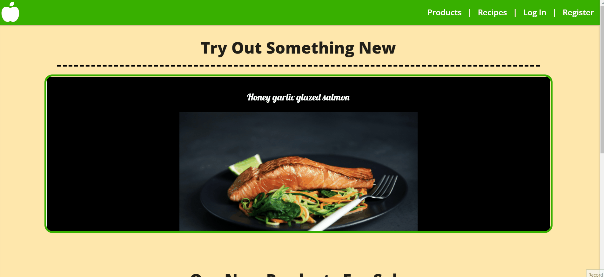

- Clicking on the bar icon on the small screen will unfold the navigation menu on the right of the screen:

    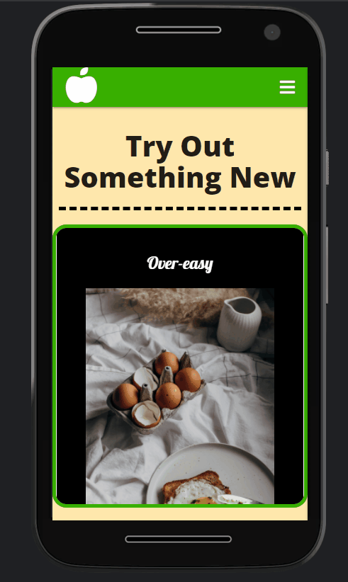

- Holding and dragging carousel item will scroll to the next carousel item:

    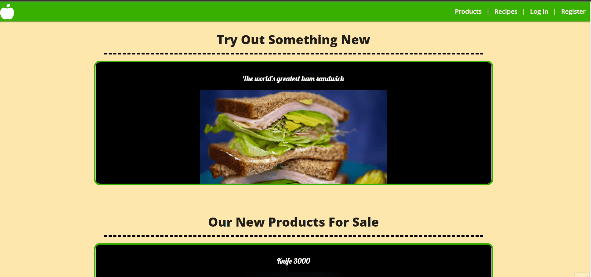

- Clicking carousel item will pop up a modal with the item description:

    

- Entering a word or phrase will display specific items in the product catalog under all products section:

    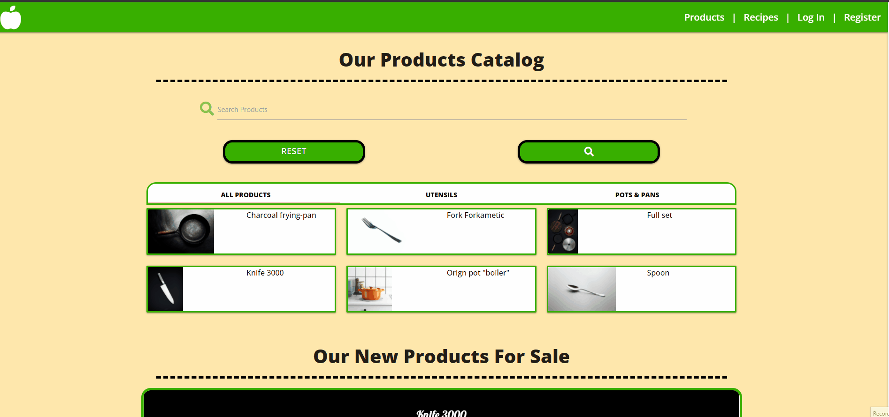

- Clicking on catalog section will display the type of product:

    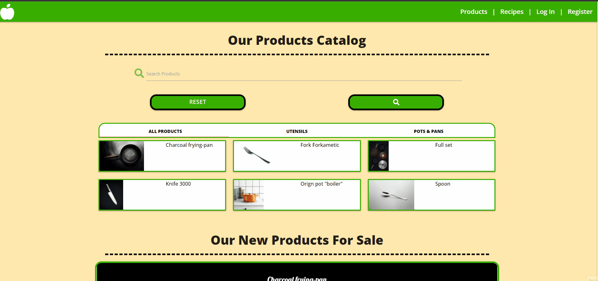

- Clicking on catalog item will pop up a modal with the item's description:

    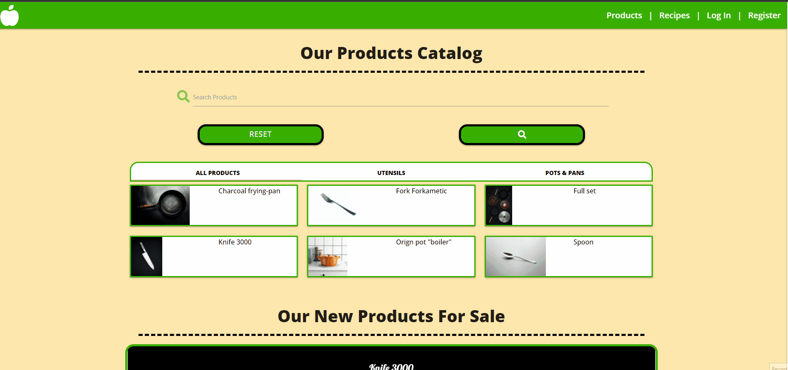

- Registering a user. If username already exists a flash message appears. Passwords must match:

    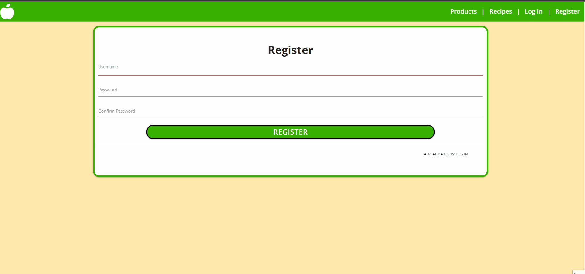

- Logging in. If username or password is incorrect a flash message appears:

    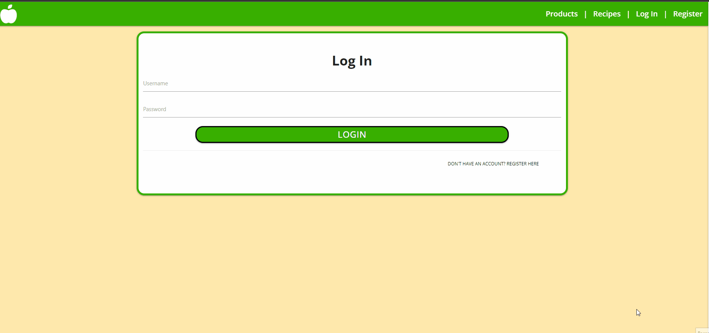

- Changing image for user profile. (Using saved screenshot). Cloudinary widget appears, only upload from devise is currently working:

    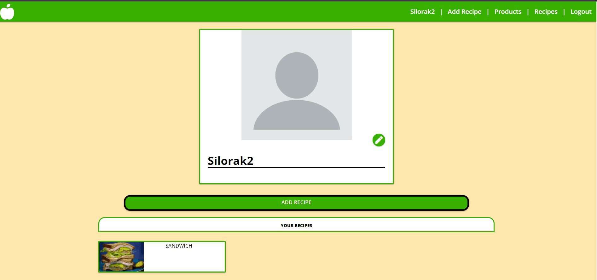

- Clicking add recipe button will open add recipe form:

    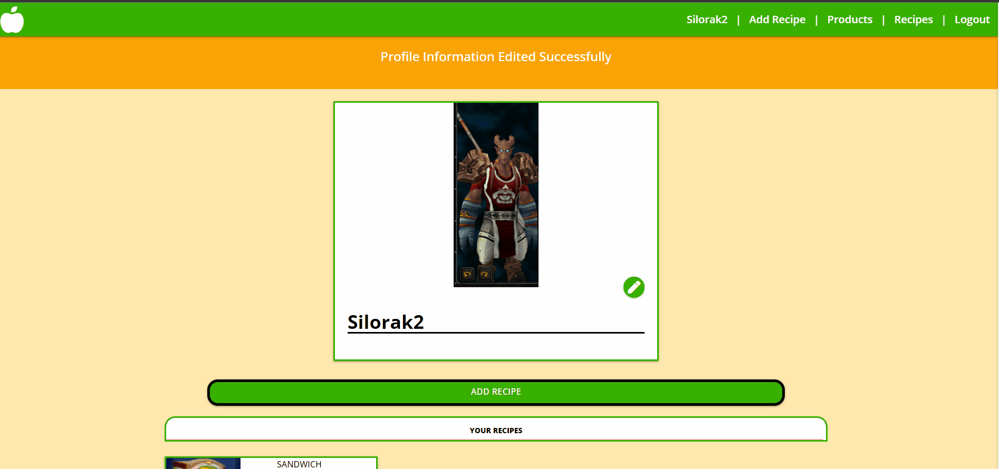

- Clicking add an ingredient or add directions will add an input field. Clicking remove button will remove input file:

    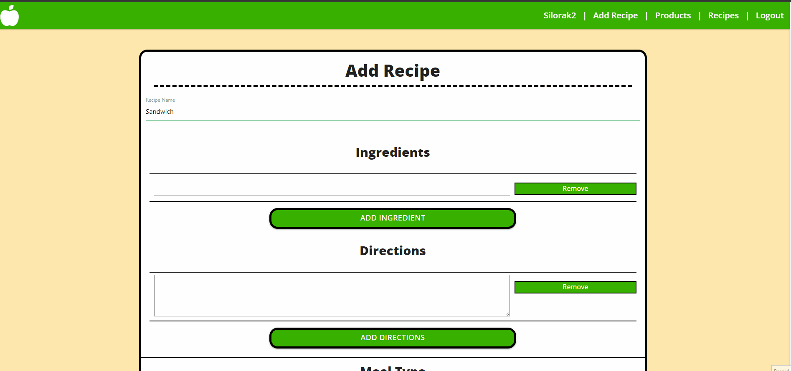

- Clicking upload image will open Cloudinary widget, only uploads from devise is currently working:

    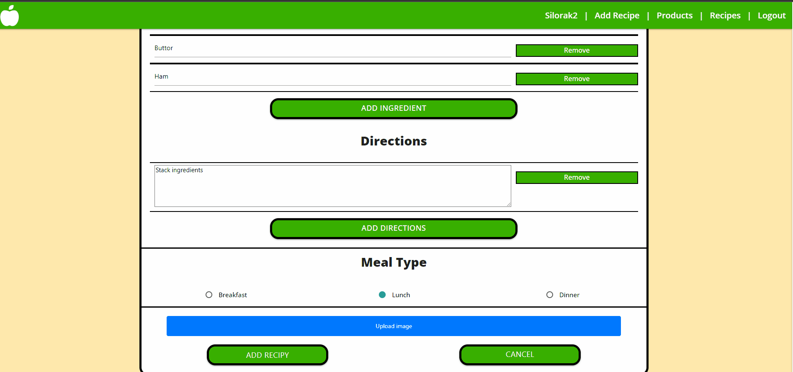

- Clicking on a recipe on profile page will open a modal with descriptions, edit and delete buttons:

    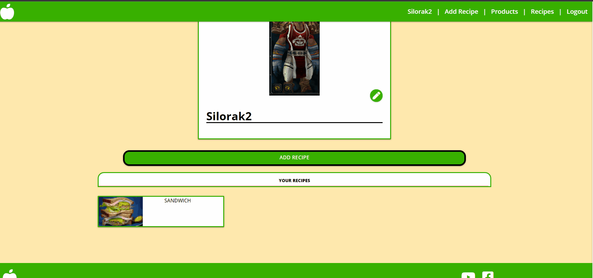

- Clicking edit button will open edit recipe form with recipe information:

    

- Edit recipe form can change images, add, remove or edit ingredients and directions:

    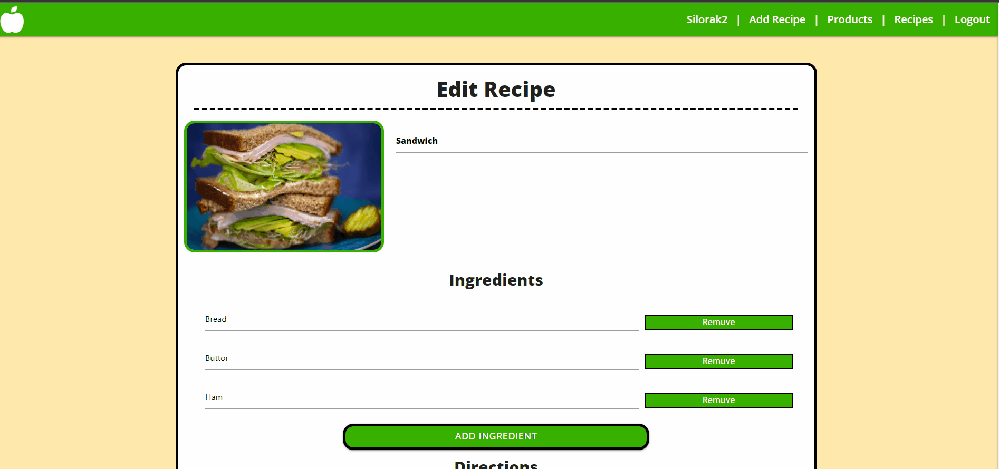

- After clicking delete for a recipe a confirmation window opens:

    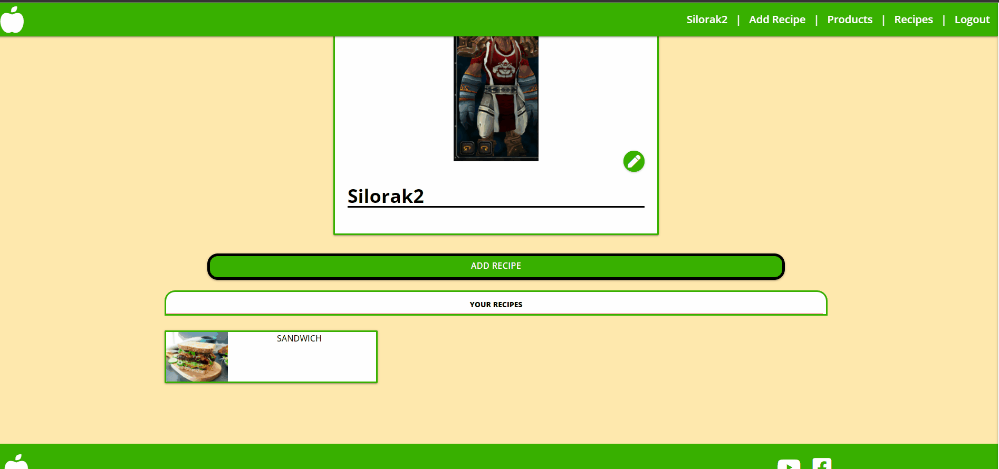

- Admin users can add products by clicking add products button. Form works the same as add recipe form:

    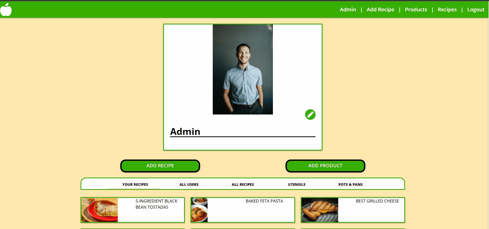

- Admin users can see all users in all user sections on the profile page. Admin users can delete any user except for admin user:

    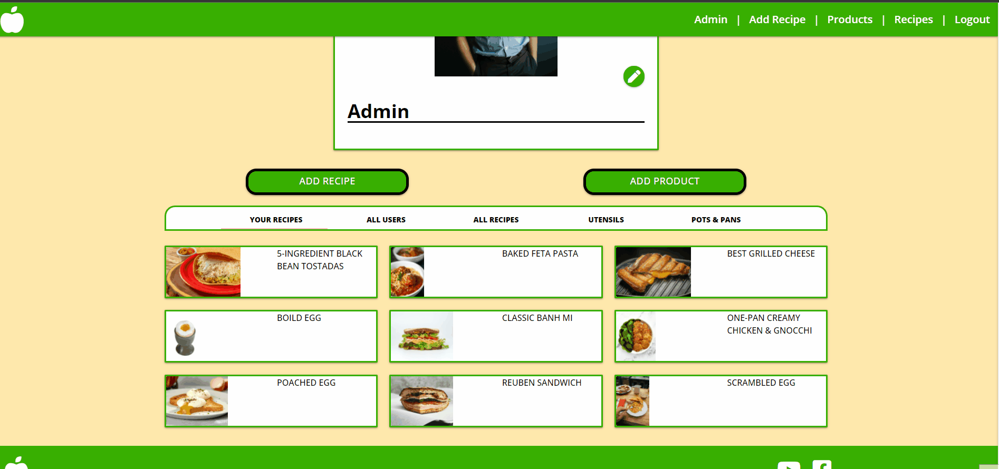

- Admin users can see all recipes and delete any recipe:

    

- Clicking on footers social media icons will open a new window to that site:

    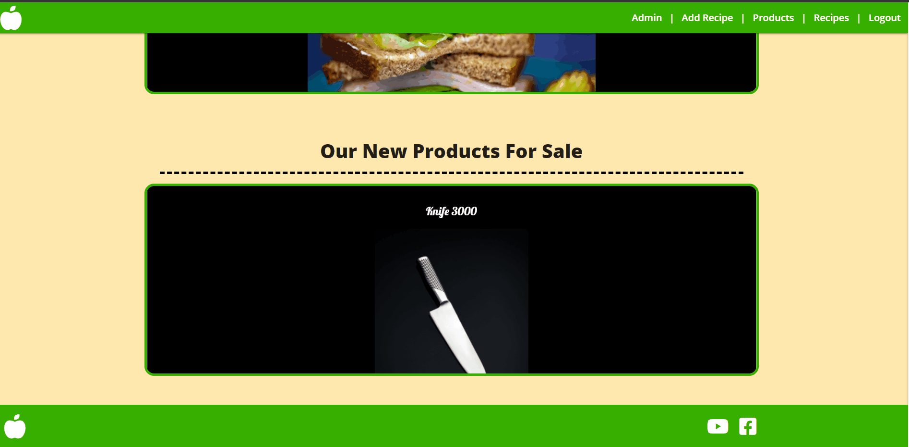

## User testing 
Family members and friends, were asked to review the site and documentation to point out any bugs and/or user experience issues. 

It was through this testing that the following changes were made:
- Change the layout of the pages.
- Navigation bar was fixed to the top.
- Change the catalog for list to grid.

[Back to top ⇧](#table-of-contents)